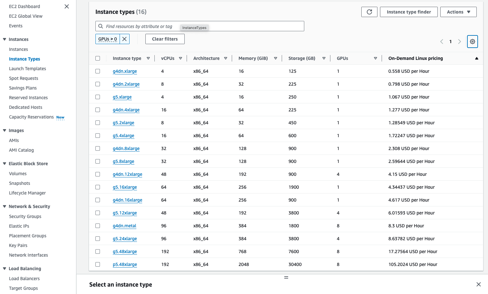

## Goal
The goal is to run an LLM on Amazon cloud such that I can write code to generate requests at a high rate and measure the performance of the LLM's response.

## Expected result
The end result should be an LLM model such as llama or mistral running inference on the cloud, monitored by prometheus.

## Sources
How to run Mistral 7B Model with Chat-UI💬 on Amazon EC2 [^how-to-run-mistral]

[^how-to-run-mistral]: [https://medium.com/@dminhk/how-to-run-mistral-7b-model-with-chat-ui-on-amazon-ec2-eef6554cd456](https://medium.com/@dminhk/how-to-run-mistral-7b-model-with-chat-ui-on-amazon-ec2-eef6554cd456)

## Amazon instance details
- Image: "Deep Learning OSS Nvidia Driver AMI GPU PyTorch 2.3 (Ubuntu 20.04)" (ami-0c24c447880015773)[^deep-learning-ami]
- For 1 GPU, g5.xlarge instance; for 4 GPUs, g5.12xlarge. See instance comparison tool [^instance-comparison-tool]
- key pair: created new `harold-aws-rsa`
- ssh, 8080 ports open
- 512GB storage
- In advanced, enable _spot instance_ to save costs



[^deep-learning-ami]: [https://docs.aws.amazon.com/dlami/latest/devguide/appendix-ami-release-notes.html](https://docs.aws.amazon.com/dlami/latest/devguide/appendix-ami-release-notes.html)

[^instance-comparison-tool]: [https://eu-north-1.console.aws.amazon.com/ec2/home?region=eu-north-1#InstanceTypes:v=3;gpus=%3E0;sort=default-otherLinux](https://eu-north-1.console.aws.amazon.com/ec2/home?region=eu-north-1#InstanceTypes:v=3;gpus=%3E0;sort=default-otherLinux)

# Summary of steps
- Create an Amazon EC2 Instance
- Create a Docker network for container communication
- Run a Mistral 7B Instruct model in TGI container using Docker and AWQ Quantization
- Run prometheus
- Run queries

## Create an instance 
The following are from [^how-to-run-mistral] with modifications indicated.

1. Create an EC2 instance with image `ami-0c24c447880015773` (Deep Learning OSS Nvidia Driver AMI GPU PyTorch 2.3 (Ubuntu 20.04)), with instance type `g5.xlarge`, 512GB of storage, and a new or existing keypair  for ssh, and ssh and 8080 ports open

1 GPU, regular:
```commandline
aws ec2 run-instances --image-id "ami-0c24c447880015773" \
    --instance-type "g5.xlarge" \
    --key-name "harold-aws-rsa" \
    --block-device-mappings '{"DeviceName":"/dev/sda1","Ebs":{"Encrypted":false,"DeleteOnTermination":true,"Iops":3000,"SnapshotId":"snap-0b7487c9f2581c30d","VolumeSize":512,"VolumeType":"gp3","Throughput":125}}' \
    --network-interfaces '{"AssociatePublicIpAddress":true,"DeviceIndex":0,"Groups":["sg-00d3cee852f586c48"]}' \
    --tag-specifications '{"ResourceType":"instance","Tags":[{"Key":"Name","Value":"harold-llm"}]}' \
    --private-dns-name-options '{"HostnameType":"ip-name","EnableResourceNameDnsARecord":true,"EnableResourceNameDnsAAAARecord":false}' \
    --count "1" 
```

4 GPUs, regular:
```commandline
aws ec2 run-instances --image-id "ami-0c24c447880015773" \
    --instance-type "g5.12xlarge" \
    --key-name "harold-aws-rsa" \
    --block-device-mappings '{"DeviceName":"/dev/sda1","Ebs":{"Encrypted":false,"DeleteOnTermination":true,"Iops":3000,"SnapshotId":"snap-0b7487c9f2581c30d","VolumeSize":512,"VolumeType":"gp3","Throughput":125}}' \
    --network-interfaces '{"AssociatePublicIpAddress":true,"DeviceIndex":0,"Groups":["sg-00d3cee852f586c48"]}' \
    --tag-specifications '{"ResourceType":"instance","Tags":[{"Key":"Name","Value":"harold-llm"}]}' \
    --private-dns-name-options '{"HostnameType":"ip-name","EnableResourceNameDnsARecord":true,"EnableResourceNameDnsAAAARecord":false}' \
    --count "1" 
```

1 GPU, spot:
```commandline
aws ec2 run-instances --image-id "ami-0c24c447880015773" \
    --instance-type "g5.xlarge" \
    --key-name "harold-aws-rsa" \
    --block-device-mappings '{"DeviceName":"/dev/sda1","Ebs":{"Encrypted":false,"DeleteOnTermination":true,"Iops":3000,"SnapshotId":"snap-0b7487c9f2581c30d","VolumeSize":512,"VolumeType":"gp3","Throughput":125}}' \
    --network-interfaces '{"AssociatePublicIpAddress":true,"DeviceIndex":0,"Groups":["sg-00d3cee852f586c48"]}' \
    --tag-specifications '{"ResourceType":"instance","Tags":[{"Key":"Name","Value":"harold-llm"}]}' \
    --instance-market-options '{"MarketType":"spot"}' \
    --private-dns-name-options '{"HostnameType":"ip-name","EnableResourceNameDnsARecord":true,"EnableResourceNameDnsAAAARecord":false}' \
    --count "1" 
```

4 GPUs, spot:
```commandline
aws ec2 run-instances --image-id "ami-0c24c447880015773" \
    --instance-type "g5.12xlarge" \
    --key-name "harold-aws-rsa" \
    --block-device-mappings '{"DeviceName":"/dev/sda1","Ebs":{"Encrypted":false,"DeleteOnTermination":true,"Iops":3000,"SnapshotId":"snap-0b7487c9f2581c30d","VolumeSize":512,"VolumeType":"gp3","Throughput":125}}' \
    --network-interfaces '{"AssociatePublicIpAddress":true,"DeviceIndex":0,"Groups":["sg-00d3cee852f586c48"]}' \
    --tag-specifications '{"ResourceType":"instance","Tags":[{"Key":"Name","Value":"harold-llm"}]}' \
    --instance-market-options '{"MarketType":"spot"}' \
    --private-dns-name-options '{"HostnameType":"ip-name","EnableResourceNameDnsARecord":true,"EnableResourceNameDnsAAAARecord":false}' \
    --count "1" 
```


2. List EC2 instances to verify it's there:
```commandline
aws ec2 describe-instances \
    --query "Reservations[*].Instances[*].[InstanceId,State.Name,Tags[?Key=='Name'].Value|[0],PublicIpAddress,PublicDnsName]" \
    --output table
```

3. Set environment variable AWS_HOST to host
```commandline
AWS_HOST=$(aws ec2 describe-instances \
    --query "Reservations[*].Instances[?Tags[?Key=='Name'].Value | [0] == 'harold-llm'].[PublicDnsName]" \
    --output text)
```

## Setup a Docker network so containers can communicate
1. Log in to the instance: `ssh -i "~/secrets/harold-aws-rsa.pem" ubuntu@${AWS_HOST}`
2. Set up a docker network so that prometheus can scrape tgis:
```bash
docker network create param-est 
```

## Copy files to AWS host
```commandline
scp -i ~/secrets/harold-aws-rsa.pem prometheus.yml requirements.txt *.py ubuntu@${AWS_HOST}:
```

## Run TGIS
1. Start docker container of tgis running mistral-7b with AWQ quantization:
   a. With one GPU
```bash
model=TheBloke/Mistral-7B-Instruct-v0.1-AWQ
volume=$PWD/data
docker run --gpus '"device=0"' -e CUDA_VISIBLE_DEVICES=0 -e MAX_CONCURRENT_REQUESTS=1000 \
--shm-size 1g -d -p 8080:80 -v $volume:/dat --name tgis \
--network param-est ghcr.io/huggingface/text-generation-inference:latest \
--model-id $model --quantize awq \
--max-concurrent-requests 1000 \
--max-input-tokens 8142 \
--max-total-tokens 16384 \
--max-batch-prefill-tokens 8142
```
   b. With two GPUs
```bash
model=TheBloke/Mistral-7B-Instruct-v0.1-AWQ
volume=$PWD/data
docker run --gpus '"device=0,1"' -e CUDA_VISIBLE_DEVICES=0,1 -e MAX_CONCURRENT_REQUESTS=1000 \
--shm-size 1g -d -p 8080:80 -v $volume:/dat --name tgis \
--network param-est ghcr.io/huggingface/text-generation-inference:latest \
--model-id $model --quantize awq \
--max-concurrent-requests 1000 \
--max-input-tokens 8142 \
--max-total-tokens 81936 \
--max-batch-prefill-tokens 8142
```
   c. With four GPUs
```bash
model=TheBloke/Mistral-7B-Instruct-v0.1-AWQ
volume=$PWD/data
docker run --gpus '"device=0,1,2,3"' -e CUDA_VISIBLE_DEVICES=0,1,2,3 -e MAX_CONCURRENT_REQUESTS=1000 \
--shm-size 1g -d -p 8080:80 -v $volume:/dat --name tgis \
--network param-est ghcr.io/huggingface/text-generation-inference:latest \
--model-id $model --quantize awq \
--max-concurrent-requests 1000 \
--max-input-tokens 8142 \
--max-total-tokens 196608 \
--max-batch-prefill-tokens 8142
```
2. Check server and check GPU usage:
```bash
docker logs -f tgis
nvidia-smi
```


## Run Prometheus 
1. Create a directory and config file for prometheus
```bash
mkdir prometheus
cd prometheus/
```
2. Create `prometheus.yml` with the following contents:
```yaml
# my global config
global:
  scrape_interval: 15s # Set the scrape interval to every 15 seconds. Default is every 1 minute.
  evaluation_interval: 15s # Evaluate rules every 15 seconds. The default is every 1 minute.
  # scrape_timeout is set to the global default (10s).

# Alertmanager configuration
alerting:
  alertmanagers:
    - static_configs:
        - targets:
          # - alertmanager:9093

# Load rules once and periodically evaluate them according to the global 'evaluation_interval'.
rule_files:
  # - "first_rules.yml"
  # - "second_rules.yml"

# A scrape configuration containing exactly one endpoint to scrape:
# Here it's Prometheus itself.
scrape_configs:
  # The job name is added as a label `job=<job_name>` to any timeseries scraped from this config.
  - job_name: "prometheus"

    # metrics_path defaults to '/metrics'
    # scheme defaults to 'http'.

    static_configs:
      - targets: ["localhost:9090"]

  - job_name: "tgis"
    scrape_interval: 1s
    static_configs:
      - targets: ["tgis:80"]

```
3. Run prometheus docker container:
```bash
docker run -d -p 9090:9090 \
-v ${PWD}/prometheus.yml:/etc/prometheus/prometheus.yml \
--name prometheus \
--network param-est \
prom/prometheus
```

4. In another terminal, tunnel the prometheus port to localhost using ssh tunnel:
```bash
ssh -i "~/secrets/harold-aws-rsa.pem" -N -L 9090:localhost:9090 ubuntu@ec2-13-60-47-136.eu-north-1.compute.amazonaws.com
```

5. Check prometheus in browser at [http://localhost:9090](http://localhost:9090)

## Run experiments
1. Start a fourth session - this one is on same instance for now
2. Create a directory and install prerequisites
```bash
pip install aiohttp numpy requests
```
3. Make a directory for the experiments on the instance:
```bash
mkdir experiments
cd experiments
```
4. Copy the python files over
```bash
scp -i "~/secrets/harold-aws-rsa.pem" *.py ubuntu@ec2-13-60-47-136.eu-north-1.compute.amazonaws.com:experiments/
```
5. Start the metrics
```commandline
python metrics.py -
```
6. Run the experiment possible in several terminals simultaneously either on laptop or on instance
```bash
python sender.py -u http://ec2-13-60-47-136.eu-north-1.compute.amazonaws.com:8080/generate -n 100 -w 1000
```


## References
